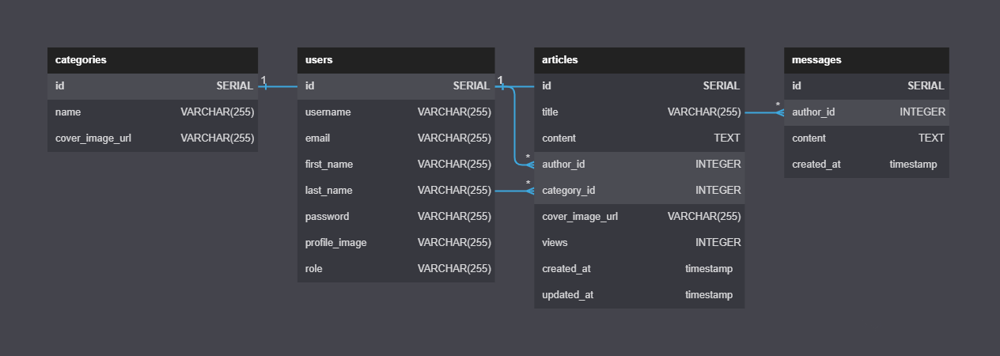

# Erudita - Database

## Instruktionen
Alle Intruktionen, wie sie die Datenbank erstellen können, finden Sie hier: [general_database](https://github.com/EruditaWiki/general#datenbank)

## Entity Relationship Diagram

## Lizenz
Erudita wird unter der Apache License 2.0 veröffentlicht. Weitere Informationen finden Sie in der [LICENSE](LICENSE) Datei.
